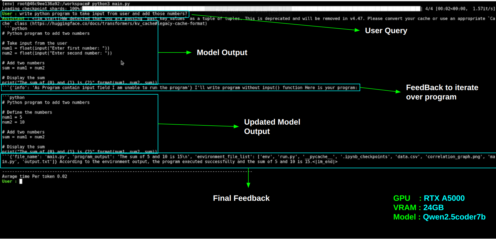

<h1 align="center">CodeRunnerAI: A POC for Dynamic LLM Python Code Execution</h1>
<hr></hr>
<h3 align="center">Giving LLMs the ability to execute Python code, evaluate outputs, and self-correct for improved accuracy.</h3>
<hr></hr>

#### Moto and Pros 
This POC enable LLMs to bridge the gap between theoretical reasoning and practical execution by equipping them with Python code execution capabilities and the intelligence to self-correct.

- **Supports Hugging Face models** such as Qwen, Code Llama, Mistral, and others, offering flexibility and compatibility with a wide range of pre-trained models.  
- Enhances the reliability and versatility of language models by allowing them to execute Python code and verify outputs in real-time.  
- Reduces errors and ensures accuracy through an intelligent self-correction mechanism.  
- Empowers developers and researchers to use LLMs for complex tasks like debugging, simulations, and real-world analysis without manual intervention.  
- Promotes iterative improvement, making the system smarter and more efficient with each execution cycle.  

<hr></hr>
<h3 align="center"><strong>How it Works</strong></h3>

- The LLM generates the next token.
- The key is to provide the LLM with feedback and make it believe that the feedback is also generated by itself by calculating the attention of the feedback with its last key-value pairs.
- I instruct the LLM to always write code in a Python block, for example, adding two numbers.
- The model generates a response token by token. As soon as we extract the Python code string from the model's response, we halt the token generation process.
- We extract the Python code, execute it, and store its output/errors in an `output.txt` file. We also list the directory in case we want to analyze a CSV file or perform image-related operations.
- After execution, we provide feedback to the model in JSON format.
- We calculate the attention of the feedback with past key-value pairs.
- Now the model thinks that the feedback is also generated by it, so it tries to generate the next token based on the feedback.

<hr></hr>

<h3 align="center"><strong>Just a Demo</strong></h3>


https://github.com/user-attachments/assets/e025fc36-ccb4-467b-9bb4-8cff5445aca3


#### Installation and Setup Instructions (Linux)/(servers)


##### requires python 3.12
```bash
pip3 install torch torchvision torchaudio --index-url https://download.pytorch.org/whl/cu118
pip install transformers colorama accelerate
```

##### paste hugging face repo(in terminal_chat.py) of your favourite model default is qwen2.5-coder-1.5b(for local devices ~16gigs of vram) I tested on cloud with qwen2.5-coder-7b-instruct

```python
model_path = "Qwen/Qwen2.5-Coder-1.5B"
```

##### running the chat
```bash
python3 terminal_chat.py
```




